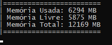

## Analisador de memoria RAM - NodeJs

#### Requisito:

	-NodeJs

### Instruções:

Baixe o Projeto ou faça o clone do repositorio utilizando o terminal com:

 #### git clone https://github.com/EdgarOlv/AnalisadorRam.git

Entre na pasta do projeto, e via terminal execute:

 #### node app.js
